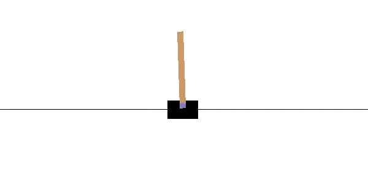

# openAI_cartPole

### About
This project have it´s goal in using a learning algorithm to balance the pole on the cart. 

### My submission
I chose to use the strategy of deep neural network (DNN). This was done using 5 fully connected layers.
There are some tweeks to the process. 
- Randomly generate a lot of samples
- Choose only the best of these
- Train your network on them
- Go one or more iterations.
- Models predictions gives new samples.
- Models prediction have a 20% chance of random. (prevent overfitting)
